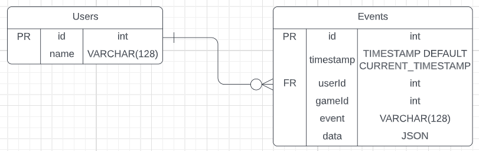

# Database Game

Simple game for monitoring game events and storing them in a database.

The game is a simple guess the number, where everything is being logged to a db.

The database is a MySQL db consisting of 2 tables:

```sql
CREATE TABLE `Users` (
  `id` int NOT NULL AUTO_INCREMENT,
  `name` VARCHAR(128) ,
  PRIMARY KEY (`id`)
);

CREATE TABLE `Events` (
  `id` int NOT NULL AUTO_INCREMENT,
  `timestamp` TIMESTAMP NOT NULL DEFAULT CURRENT_TIMESTAMP,
  `userId` int NOT NULL,
  `gameId` VARCHAR(36) DEFAULT NULL,
  `event` VARCHAR(128) NOT NULL,
  `data` JSON DEFAULT NULL,
  FOREIGN KEY (`userId`) REFERENCES `Users`(`id`),
  PRIMARY KEY (`id`)
);
```


